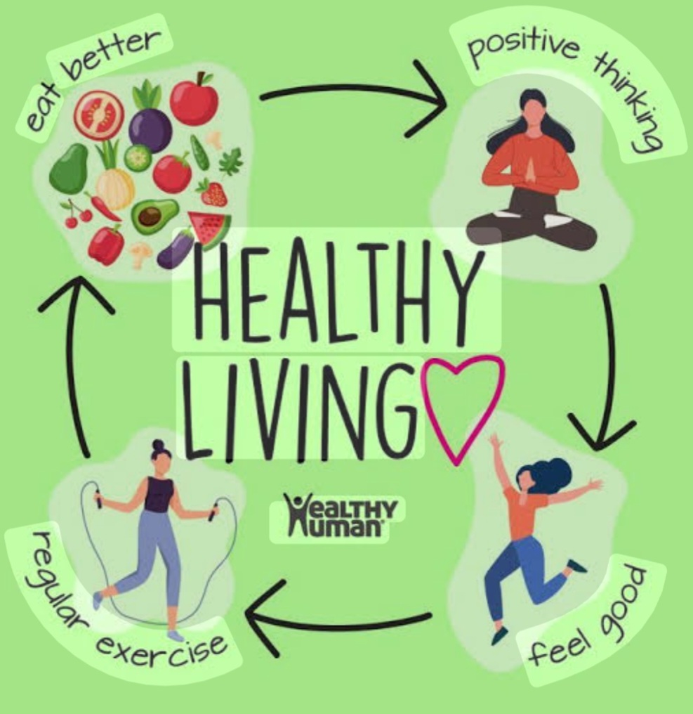
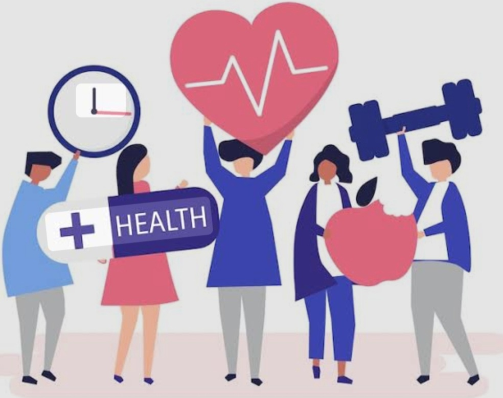

# 🏥 Health Care & Healthy Living

Health care and healthy living are essential for maintaining a healthy and active life. Good health depends on proper nutrition, regular physical activity, mental well-being, personal hygiene, and timely medical care.

---

## 🏥 Health Care

Health care helps people prevent diseases, identify health problems early, and receive proper treatment when needed.

### Importance of Health Care

- Preventing diseases
- Regular health check-ups
- Diagnosing and treating illnesses
- Taking medicines as advised by health professionals
- Maintaining physical and mental well-being

---

## 🥗 Healthy Living

A healthy lifestyle helps us stay physically and mentally fit.

### Healthy Habits

- 🍎 Eat a balanced and nutritious diet
- 🏃 Exercise regularly
- 🧘 Maintain positive mental health
- 😴 Get enough sleep and rest
- 💧 Drink enough water
- 🧼 Maintain good personal hygiene

---

## ❤️ Complete Health

Complete health involves taking care of different aspects of our well-being.

### Key Aspects

- 💪 Physical health
- 🥗 Healthy diet
- 🩺 Medical care
- 🧠 Mental well-being
- 🌿 Healthy lifestyle

---

## 🌿 Key Message

**“Health is Wealth.”**

Taking care of our physical and mental health through healthy habits and proper health care helps us lead a happier, healthier, and more active life.

---

## 🎯 Conclusion

Healthy living is a continuous process. By making healthy choices every day and seeking medical care when necessary, we can improve our overall well-being and enjoy a better quality of life.
